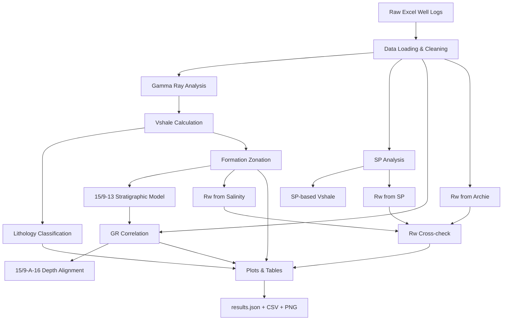

<div align="center">

# Well Logging & Petrophysical Analysis

**Petrophysical interpretation and well correlation workflow for the Sleipner CO₂ Storage Dataset**

<br>


<br>

`Well Logging` · `Petrophysics` · `Formation Evaluation` · `CCS`

</div>

---

## Overview

This repository contains a Python-based workflow for well-log processing and
petrophysical interpretation using data from the **Sleipner CO₂ Storage
Dataset**.

The analysis focuses on wells **15/9-13** and **15/9-A-16** and includes:

- Gamma Ray and Spontaneous Potential analysis
- shale-volume estimation
- lithology classification
- formation zonation
- inter-well correlation
- formation-water resistivity estimation

The workflow is divided into independent modules so that data processing,
petrophysical calculations, plotting, and interpretation can be modified and
tested separately.

---

##  Geological Context

The **Sleipner CO₂ storage project** is one of the world's longest-running industrial-scale geological carbon storage projects.

CO₂ separated from produced natural gas has been injected into the **Utsira Formation**, a highly porous and permeable saline sandstone formation beneath the North Sea.

The **Sleipner 2019 Benchmark Model** provides reference subsurface data for research related to:

- CO₂ storage,
- reservoir characterization,
- geophysical monitoring,
- geological modeling, and
- petrophysical interpretation.

The reference dataset includes the wells **15/9-13** and **15/9-A-16**, which are used in this repository for well-log interpretation and stratigraphic correlation.

**Dataset:** Sleipner 2019 Benchmark Model  
**Data provider:** Equinor / CO₂DataShare  
**DOI:** `10.11582/2020.00004`

> This repository is an independent academic interpretation workflow and is not an official Equinor or CO₂DataShare software product.

---

#  Project Objectives

The workflow is designed to answer several petrophysical questions:

1. How does **Gamma Ray response vary with depth** in both wells?
2. How much shale is present within each logged interval?
3. How sensitive is shale-volume estimation to the selected empirical model?
4. Where are the major sandstone and shale boundaries within the Utsira interval?
5. Can stratigraphic markers observed in **15/9-13** be correlated with **15/9-A-16**?
6. How consistent are formation-water resistivity estimates obtained using different methods?
7. How can the complete interpretation be reproduced automatically from the original input data?

---

#  Analysis Workflow



---

## Methodology

### Gamma Ray Index

Gamma Ray is used as the main lithological indicator in this workflow.
The log response is normalized between a clean-sand reference and a shale
reference using the Gamma Ray index:

$$
I_{GR} =
\frac{GR_{\mathrm{log}} - GR_{\min}}
     {GR_{\max} - GR_{\min}}
$$

where:

- $GR_{\mathrm{log}}$ is the measured Gamma Ray response,
- $GR_{\min}$ represents the clean-sand reference,
- $GR_{\max}$ represents the shale reference.

The reference values are defined in `config.py`, allowing the interpretation
parameters to be changed without modifying the calculation modules.

---

## 4. Lithology Classification

Intervals are classified using shale-volume thresholds defined in `config.py`.

| Vsh Range | Interpretation |
|---|---|
| Vsh < 0.10 | Clean Sand |
| 0.10 ≤ Vsh ≤ 0.33 | Shaly Sand |
| Vsh > 0.33 | Shale |

These thresholds are interpretation criteria rather than universal geological
constants and may need recalibration when the workflow is applied to another
field or formation.

---

## 5. Spontaneous Potential Analysis

The **Spontaneous Potential (SP)** log is analyzed independently from Gamma Ray.

SP response is influenced by the electrochemical contrast between:

- formation water,
- mud filtrate, and
- permeable formations.

Within suitable intervals, shale and clean-sand baselines are estimated and used to derive an SP-based shale indicator.

The SP-derived estimate provides an independent comparison against GR-derived Vsh.

This is useful because agreement between different logging responses increases confidence in the interpretation, while disagreement can indicate:

- noisy logs,
- changing formation-water salinity,
- invasion effects,
- baseline drift,
- thin-bed effects, or
- inappropriate petrophysical assumptions.

---

#  Formation Zonation

The workflow performs automated zonation primarily using the **15/9-13 Gamma Ray log**.

Reference sand and shale windows are defined first. Smoothed GR responses are then used to detect major transitions.

The interpretation identifies features such as:

- **Sand Wedge**
- **Top Utsira**
- internal Utsira intervals,
- thin mudstone layers,
- **Utsira L8–L1**, and
- **Base Utsira**

Peak detection is used to identify thin higher-GR intervals that may represent internal mudstones.

The resulting zonation becomes the common stratigraphic reference used by subsequent modules.

> Automatic picks should be treated as reproducible computational interpretations, not substitutes for validated geological well picks.

Manual picks can be introduced through `MANUAL_PICKS` in `config.py` when authoritative formation tops are available.

---

#  Well-to-Well Correlation

The repository includes a dedicated correlation workflow between:

**15/9-13** ↔ **15/9-A-16**

The correlation is primarily based on Gamma Ray character.

Because the wells use different depth representations in the comparison, the workflow:

1. interpolates GR curves onto a common depth increment,
2. evaluates a range of vertical shifts,
3. calculates correlation coefficients,
4. identifies prominent GR peaks,
5. matches potential stratigraphic markers,
6. compares major Utsira boundaries, and
7. constructs a graphical well-correlation panel.

The search is intentionally performed across multiple possible shifts rather than forcing a predetermined alignment.

This allows the selected correlation to be evaluated against nearby alternatives.

### Correlation outputs include

- optimum depth shift,
- full-window GR correlation,
- intra-Utsira correlation,
- number of matched GR peaks,
- major formation boundaries,
- tie points between wells, and
- unmatched markers.

---

#  Formation Water Resistivity — Rw

Formation-water resistivity is evaluated through **three independent approaches**.

## Method 1 — Salinity-based Rw

Formation-water salinity is converted into resistivity using a salinity-resistivity relationship, followed by temperature correction.

A depth-dependent temperature profile is estimated from temperature anchors defined in `config.py`.

This provides an expected Rw range throughout the target interval.

---

## Method 2 — SP-derived Rw

The SP response is evaluated using:

- shale baseline,
- clean-sand baseline,
- maximum effective SP response,
- mud-filtrate resistivity,
- temperature correction, and
- several interpretation scenarios.

Because SP-derived Rw can be sensitive to uncertain mud and formation-water conditions, multiple assumptions are retained instead of presenting one apparently exact value.

---

## Method 3 — Archie-based Rw

For clean water-bearing formations, Archie’s equation can be written as:

$$
R_t = \frac{aR_w}{\phi^m S_w^n}
$$

For sufficiently clean intervals where:

$$
S_w \approx 1
$$

the equation can be rearranged to estimate $R_w$.

Multiple cementation-factor assumptions are evaluated to examine sensitivity.

---

## Rw Cross-check

The three approaches are compared on a common basis:

```text
Salinity-derived Rw
          │
          ├──────────────┐
          │              │
SP-derived Rw ───────────┼──► Rw consistency assessment
          │              │
          └── Archie Rw ─┘
```

The purpose is **not to force the three methods to return identical values**.

Instead, discrepancies are used to identify uncertainty in:

- salinity,
- temperature,
- SP interpretation,
- mud-filtrate properties,
- Archie parameters,
- porosity measurements, and
- clean-sand selection.

---

#  Repository Structure

```text
Well-Logging/
│
├── config.py
│   └── Central configuration, assumptions,
│       thresholds, search windows, and constants
│
├── io_logs.py
│   └── Excel loading, numerical conversion,
│       null handling, and log quality control
│
├── vshale.py
│   └── Gamma Ray/SP shale-volume models,
│       lithology classification, and statistics
│
├── zonation.py
│   └── Automated formation and internal-layer
│       boundary detection
│
├── correlation.py
│   └── GR-based correlation between
│       15/9-13 and 15/9-A-16
│
├── rw.py
│   └── Formation-water resistivity estimation
│       and multi-method cross-check
│
├── plots.py
│   └── Well-log tracks, crossplots,
│       correlation panels, and Rw figures
│
├── run_all.py
│   └── Main workflow orchestrator
│
├── Well_159_13.xlsx
│   └── Input data for well 15/9-13
│
├── Well_159-A-16.xlsx
│   └── Input data for well 15/9-A-16
│
└── output/
    │
    ├── figures/
    │   └── Generated PNG figures
    │
    ├── tables/
    │   └── Generated CSV interpretation tables
    │
    └── results.json
        └── Main numerical results and statistics
```

> The two Excel files must be available in the project directory unless their paths are changed in `config.py`.

---

#  Code Architecture

The repository follows a simple separation-of-responsibility principle.

| Module | Responsibility |
|---|---|
| `config.py` | Centralized assumptions and constants |
| `io_logs.py` | Data input and cleaning |
| `vshale.py` | Vsh equations and lithology |
| `zonation.py` | Formation boundary detection |
| `correlation.py` | Inter-well GR correlation |
| `rw.py` | Formation-water resistivity |
| `plots.py` | Visualization only |
| `run_all.py` | Executes the complete workflow |

An important design principle is that numerical assumptions are concentrated in **`config.py`** rather than repeatedly hard-coded throughout the project.

This makes sensitivity analysis and future modification significantly easier.

---

#  Installation

## 1. Clone the repository

```bash
git clone https://github.com/Haikal7090/Well-Logging.git
cd Well-Logging
```

## 2. Create a virtual environment

### Windows

```bash
python -m venv .venv
.venv\Scripts\activate
```

### Linux / macOS

```bash
python3 -m venv .venv
source .venv/bin/activate
```

## 3. Install dependencies

```bash
pip install numpy pandas scipy matplotlib openpyxl
```

Main Python libraries used in the workflow:

| Library | Application |
|---|---|
| `NumPy` | Numerical calculations |
| `Pandas` | Well-log tables and Excel processing |
| `SciPy` | Signal processing and peak detection |
| `Matplotlib` | Well-log visualization |
| `openpyxl` | Excel file support |

---

#  Running the Analysis

Make sure the required Excel files are available:

```text
Well_159_13.xlsx
Well_159-A-16.xlsx
```

Then run:

```bash
python run_all.py
```

The entire workflow is executed automatically.

```text
Load logs
   ↓
Clean data
   ↓
Calculate Vsh
   ↓
Classify lithology
   ↓
Detect zones
   ↓
Analyze SP
   ↓
Correlate wells
   ↓
Estimate Rw
   ↓
Generate plots & tables
   ↓
Export results
```

When the workflow finishes, the main numerical results are stored in:

```text
output/results.json
```

while tables and figures are stored in:

```text
output/tables/
output/figures/
```

---

#  Generated Outputs

The workflow automatically generates publication/report-ready outputs.

## Well-log Interpretation

Examples include:

```text
gr_vs_depth_13.png
gr_vs_depth_A16.png

tracks_PR1_13.png
tracks_PR1_A16.png

tracks_zona_13.png

ish_vs_vsh_13.png
ish_vs_vsh_A16.png
```

These plots are used to inspect:

- GR behavior,
- SP behavior,
- Vsh model differences,
- lithological classification, and
- stratigraphic boundaries.

---

## Formation Zonation

```text
zonasi_13.csv
vsh_per_zona.csv
```

These tables summarize formation boundaries and shale-volume characteristics for individual stratigraphic intervals.

---

## Vsh Comparison

```text
crossplot_vsh_gr_vs_sp.png
```

This plot compares shale-volume estimates derived independently from Gamma Ray and SP response.

---

## Well Correlation

```text
korelasi_13_vs_A16.png
uji_shift.png
tie_korelasi.csv
```

These outputs show:

- relative vertical alignment,
- GR-pattern similarity,
- matched stratigraphic markers, and
- correlation sensitivity to the selected shift.

---

## Formation Water Resistivity

```text
rw_salinitas_profil.csv
rw_sp.csv
rw_archie_a16.csv
rw_ringkasan.csv

rw_cross_check.png
rw_perbandingan_metode.png
```

These outputs allow the three Rw estimation methods to be evaluated side-by-side.

---

#  Important Assumptions & Limitations

Petrophysical interpretation is inherently non-unique.

The numerical results produced by this repository depend on several assumptions.

### GR endpoints

The selected clean-sand and shale GR values strongly influence calculated Vsh.

They should therefore be recalibrated when the workflow is applied to another formation.

### Vsh models

Linear, Clavier, Steiber, and Larionov equations are empirical transformations.

A different Vsh equation can produce a materially different shale-volume estimate from the same Gamma Ray measurement.

### Automated zonation

Formation boundaries are detected from log character and predefined search windows.

They are computational picks rather than authoritative geological markers.

### SP interpretation

SP response can be affected by:

- borehole conditions,
- mud properties,
- salinity contrast,
- invasion,
- thin beds,
- shale content, and
- baseline drift.

SP-based Vsh and Rw should therefore be interpreted together with other logs.

### Rw assumptions

Some salinity, temperature, mud-filtrate, and Archie parameters used in this project are interpretation assumptions rather than direct measurements from the wells.

Rw results should therefore be treated as **scenario-based estimates**.

### Well correlation

A high numerical correlation does not automatically prove geological equivalence.

Correlation coefficients and peak matching must still be evaluated within the geological context of the Utsira Formation.

---

#  Configuration

Most parameters can be modified from:

```python
config.py
```

Examples include:

```text
GR endpoints
Vsh cutoffs
DT validity limits
smoothing windows
formation search windows
salinity assumptions
temperature anchors
mud-filtrate resistivity
Archie parameters
correlation shift range
peak-matching tolerance
plot colors
```

This allows sensitivity testing without modifying the core calculation modules.

---

#  Possible Future Development

The current workflow can be expanded into a more complete petrophysical interpretation framework.

Potential additions include:

- density-neutron porosity analysis,
- sonic-derived porosity,
- Pickett plots,
- water saturation,
- permeability estimation,
- net-to-gross calculation,
- automatic bad-hole detection using caliper,
- uncertainty propagation,
- interactive Plotly well-log tracks,
- LAS file input,
- automated report generation,
- machine-learning-based facies classification,
- correlation of additional Sleipner wells or synthetic wells,
- integration with seismic horizons, and
- CO₂ storage reservoir characterization.

---

#  Dataset Reference

If the Sleipner data are used in academic work, the original dataset and its associated documentation should be cited separately.

**Sleipner 2019 Benchmark Model**  
CO₂DataShare / Equinor  
DOI: `10.11582/2020.00004`

The official dataset contains simulation models, well data, petrophysical information, seismic-related products, and supporting geological information for research on the Sleipner CO₂ storage system.

---

#  Licensing Note

The **Sleipner input data** are distributed under the **Sleipner CO₂ Reference Dataset License**.

The license governing the dataset is separate from the license governing the Python source code in this repository.

If the code is intended for public reuse, redistribution, or collaboration, a dedicated software `LICENSE` file should be added to this repository.

---

<div align="center">

### Contributors

**Haikal** · **Raju**  
Petroleum Engineering

> *Reading the subsurface, one log at a time.*

</div>
